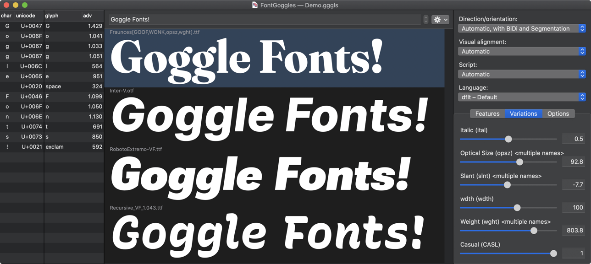
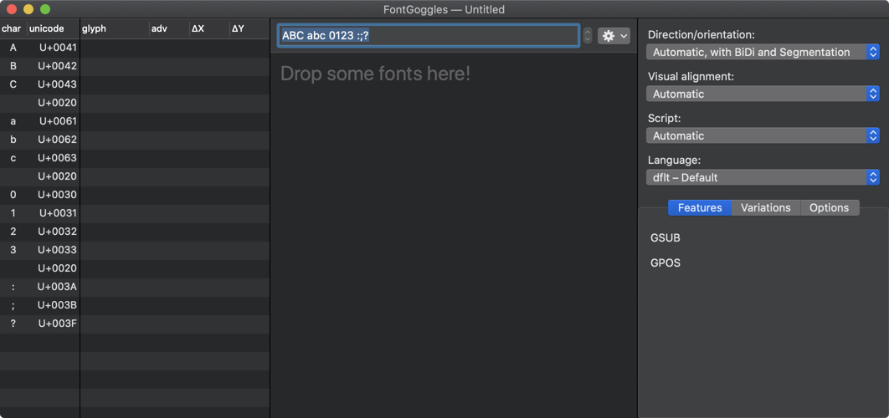
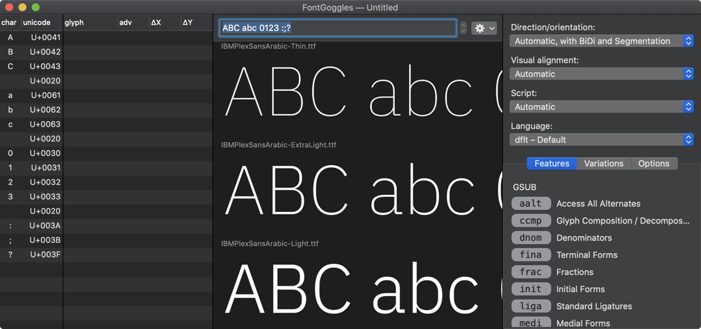
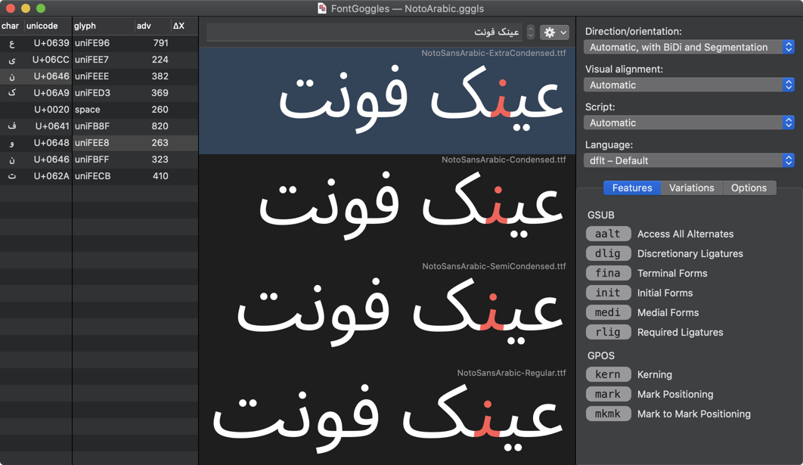
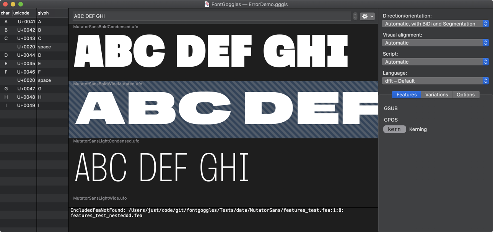

# FontGoggles

_Rich Font Previewing and Comparing_

## Overview

FontGoggles is a font viewer for various font formats. It is a desktop
application for macOS. It is free and [open source](https://github.com/justvanrossum/fontgoggles).

The main focus is text behavior, specifically text shaping and variation behavior.

You can download [the latest release here](https://github.com/justvanrossum/fontgoggles/releases/latest).

The following font formats are supported:

- .ttf/.otf (including variable fonts)
- .ttc/.otc
- .woff/.woff2
- .ufo/.ufoz
- .designspace
- .ttx

Core features:

- View multiple fonts simultaneously
- Supports complex scripts: it does proper text shaping with HarfBuzz
- Enable/disable OpenType features
- Explore design spaces
- Preview .ufo and .designspace files _as if_ they are compiled fonts
- Automatically reload fonts if they are changed on disk
- Supports vertical text layout

## Testimonials

Stephen Nixon: _“Super nice! I really love how this lets me compare the same
variable axes across multiple fonts. It’s super interesting to visually
compare how different fonts handle wght, opsz, etc. I also love that I can
put this in my mac dock and drag font files directly onto it, rather than
booting up a browser to test things. And the light/dark modes are right on
point.”_

Thomas Thiemich: _“The most impressive feature of this tool so far is its
speed — it’s quite impressive how fast it handles multiple fonts or variable
fonts.”_

## How to use

Drop some fonts (or folders with fonts) onto the application, or launch
the application, and drop some fonts onto the window.

A new, empty window looks like this:

After dropping some fonts it will look like this:

- Zoom in/out by using pinch gestures on your trackpad, or use ⌘-plus
  and ⌘-minus, or option-scroll.
- Type text in the text field to change the displayed text
- Drag and drop can be used to rearrange the fonts
- Click on a font to see the glyph positioning information
- Select glyphs by clicking on them, which will highlight glyph
  positioning info and character info

## Text settings

At the top right of the FontGoggles window you find four buttons with
popup menus:

- Direction/orientation
- Visual alignment
- Script
- Language

The _Direction/orientation_ menu has six options:

- _Automatic, with BiDi_: apply the Unicode bidirectional algorithm,
  which will determine the dominant writing direction
- _Automatic, without BiDi_: let HarfBuzz figure out the writing
  direction of the text, and do not applying the Unicode bidirectional
  algorithm
- _Left-to-Right_: force the direction of the text to be Left-to-Right
- _Right-to-Left_: force the direction of the text to be Right-to-Left
- _Top-to-Bottom_: use vertical layout, Top-to-Bottom
- _Bottom-to-Top_: use vertical layout, Bottom-to-Top

The _Visual alignment_ button controls how the rendered text is visually
aligned within the window. Its menu has four options:

- _Automatic_: Use the alignment that is most natural with the detected writing direction
- _Left_: align left
- _Right_: align right
- _Center_: align center

In vertical mode, the options are _Automatic_, _Top_, _Bottom_ and _Center_.

The _Script_ button overrides the automatic detection of the script by
HarfBuzz.

The _Language_ button allows you to specify for which language any
language-specific lookups will be activated.

## Formatting settings

The _Features_ panel shows the superset of GSUB and GPOS features of
all opened fonts. You can click feature tags to enable them (green),
disable them (red) or use their default setting (gray).

The _Variations_ panel shows sliders for all axes defined in the opened
fonts. The minimum and maximum values for an axis are the lowest and
highest values found in all opened fonts that have that axis.

When multiple variable fonts (and/or .designspace files) are opened,
all axes in all open fonts are set to their respective default values.
However, since this value can be different per font, the slider will
in that case show an arbitrary position, and the numeric field will
be empty as a sign there is not a single possible value.

The _Options_ panel has three sliders that affect the display of the
text:

- The _Relative Size_ slider controls the relative size of the text in
  comparison to the box in which is is displayed. A value of 100 scales
  the Units Per Em value to the display box size.
- The _Baseline_ slider controls the baseline position, as a percentage
  of the display box size.
- The _Margin_ slider controls the left and right margins, as a percentage
  of the display box size. Or top and bottom in vertical layout mode.

## Customize the window

Most panels in the window are resizable, and some are collapsable.
There are also “View” menu items to show and hide the collapsable
panels:

- Show/hide Character list — ⌘-1
- Show/hide Glyph list — ⌘-2
- Show/hide Compile output — ⌘-3
- Show/hide Formatting options — ⌘-4

## Load and navigate a text file

Instead of typing the text into the text field, you may load an external
text file, using the “Load Text File...” menu under “View”, or with the
“gear” popup menu next to the text field.

Once loaded, you can navigate through the lines of the text file with
the “stepper” control next to the text field. The “View” menu has shortcuts
for this: ⌘-arrow-key-up and ⌘-arrow-key-down to go to the previous or next
line respectively.

You can keep editing the text file in a text editor while it is loaded in
FontGoggles: it will reload the text file and show the changes.

## Save a project file

You can save a window as a `.gggls` project file. Apart from the viewed
fonts, it will store all text, formatting and window settings.

_Note: The file stores relative paths to the font files, so its location
is related on the location of the font files. They can move together,
but if sources move or the project file moves, the source references in
the project file become invalid._

## Edit a font with another application

If a font gets changed on-disk by another application, FontGoggles will
reload it and show the updated version. For example, this happens, when
you:

- Re-generate a .ttf or .otf from a font editor.
- Edit a .ufo with a font editor
- Edit a .ufo with a text editor
- Edit a .designspace file
- Edit a .fea file associated with a .ufo or .designspace file
- Edit a .ttx file

_Note: FontGoggles does its very best to reload as quickly as possible,
but for .ufo and .designspace it may have to re-compile OpenType
features, and the time needed depends on the complexity of the font._

## Compile warnings and errors

If, during the (re)loading of a font, a warning or error is issued, the
font list will show that by highlighting the font with a diagonally
striped background. To view the error details, click on the font, and
the compile output panel at the bottom of the font list will appear.

## Found a bug or have a question?

Please open an issue on [the FontGoggles repository](https://github.com/justvanrossum/fontgoggles/issues).

-------------------

*FontGoggles was written by [Just van Rossum](mailto:justvanrossum@gmail.com)
and funded by [GoogleFonts](https://fonts.google.com/).*

-------------------
